# BERT

## BertModel

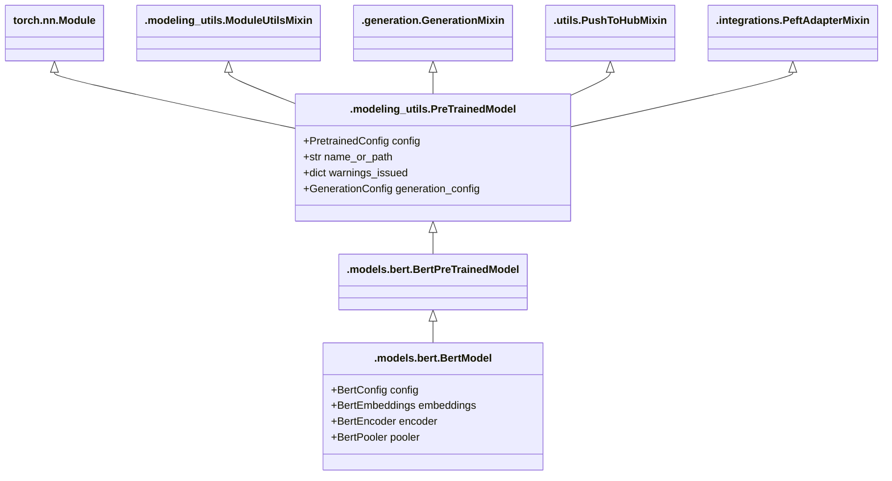

### forward()

https://github.com/huggingface/transformers/blob/v4.35.0/src/transformers/models/bert/modeling_bert.py#L910-L1038

#### input_shape

- `input_ids` : Sequence に含まれる Token それぞれについて, Vocabulary における Index を並べた `LongTensor (batch_size, sequence_length)`
- `inputs_embeds` : Embedding 結果を直接与える場合の `FloatTensor (batch_size, sequence_length, hidden_size)`

のいずれかから `input_shape = (batch_size, sequence_length)` を決定します.

```python
        if input_ids is not None and inputs_embeds is not None:
            raise ValueError("You cannot specify both input_ids and inputs_embeds at the same time")
        elif input_ids is not None:
            self.warn_if_padding_and_no_attention_mask(input_ids, attention_mask)
            input_shape = input_ids.size()
        elif inputs_embeds is not None:
            input_shape = inputs_embeds.size()[:-1]
        else:
            raise ValueError("You have to specify either input_ids or inputs_embeds")

        batch_size, seq_length = input_shape
```

#### past_key_values

`past_key_values` が与えられている場合, `past_key_values_length` を設定します.
`past_key_values` は `FloatTensor (batch_size, num_heads, sequence_length - 1, embed_size_per_head)` の tuple で長さは `config.n_layers` で決まります.

`past_key_values` (Attention Block の hidden states における計算済みの Key と Value) を使用することで Decoding の高速化が可能になるようです.

> Contains precomputed key and value hidden states of the attention blocks. Can be used to speed up decoding.

```python
        past_key_values_length = past_key_values[0][0].shape[2] if past_key_values is not None else 0
```

#### attention_mask の初期化

`attention_mask` によって, Padding された部分 (系列の長さを一律にするために付け足された `[PAD]` のような Token) を無視しています.
`attention_mask` は, 次のような `FloatTensor (batch_size, sequence_length)` です.

- `attention_mask = 1` : 無視しない Token (**not masked**)
- `attention_mask = 0` : 無視する Token (**masked**)

> Mask to avoid performing attention on padding token indices. Mask values selected in [0, 1]

`attention_mask (FloatTensor (batch_size, sequence_length))` が与えられていない場合, 全要素が1の `torch.Tensor (batch_size, seq_length)` で初期化します.
`past_key_values` が 与えられていた場合, `past_key_values_length` > 0 となっているため, それだけ長くなります.

```python
        if attention_mask is None:
            attention_mask = torch.ones(((batch_size, seq_length + past_key_values_length)), device=device)
```

## BertConfig

```python
class BertConfig(PretrainedConfig):
    def __init__(
        self,
        vocab_size=30522,
        hidden_size=768,
        num_hidden_layers=12,
        num_attention_heads=12,
        intermediate_size=3072,
        hidden_act="gelu",
        hidden_dropout_prob=0.1,
        attention_probs_dropout_prob=0.1,
        max_position_embeddings=512,
        type_vocab_size=2,
        initializer_range=0.02,
        layer_norm_eps=1e-12,
        pad_token_id=0,
        position_embedding_type="absolute",
        use_cache=True,
        classifier_dropout=None,
        **kwargs,
    ):
        # ...
```

https://github.com/huggingface/transformers/blob/v4.35.0/src/transformers/models/bert/configuration_bert.py#L143-L158

### kwargs について

[PretrainedConfig](https://huggingface.co/docs/transformers/v4.35.0/en/main_classes/configuration#transformers.PretrainedConfig) を参照してください.

## BertEmbeddings

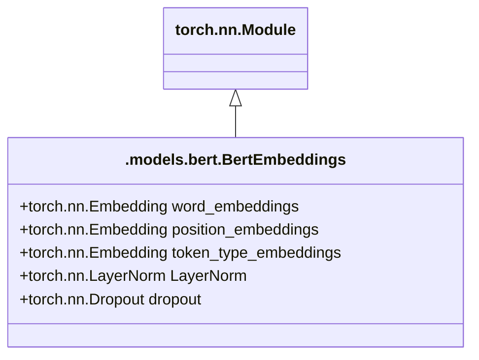

LayerNorm は Tensorflow の Checkpoint File から Model の変数を Load できるように Camel Case になっているらしい.

> self.LayerNorm is not snake-cased to stick with TensorFlow model variable name and be able to load any TensorFlow checkpoint file

## BertEncoder

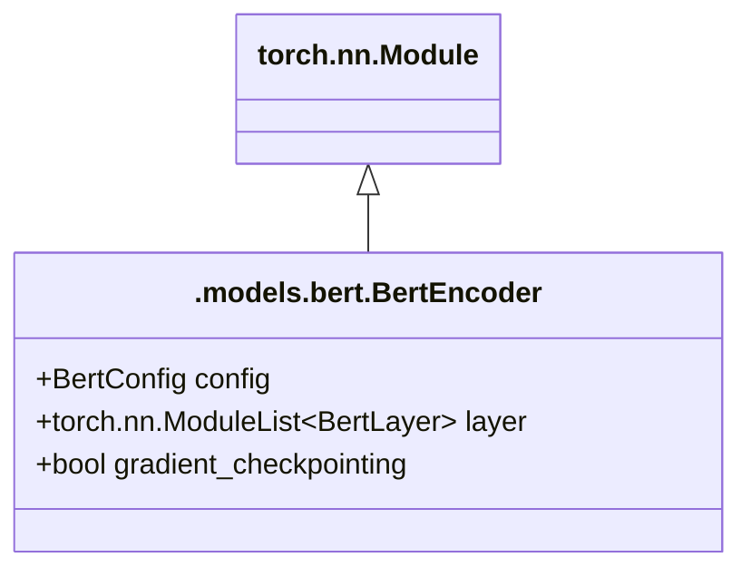

## BertLayer

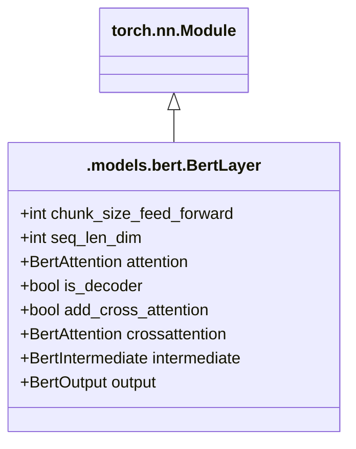

## BertAttention

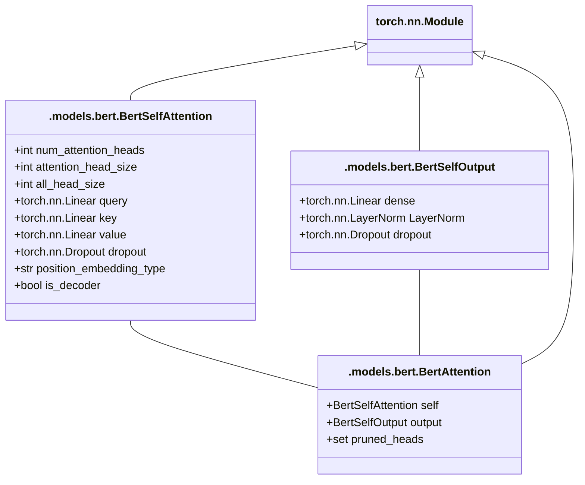

### BertSelfAttention

#### forward()

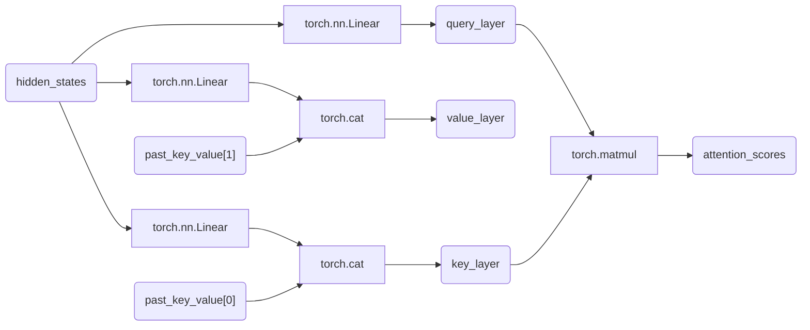

TODO: position_embedding_type

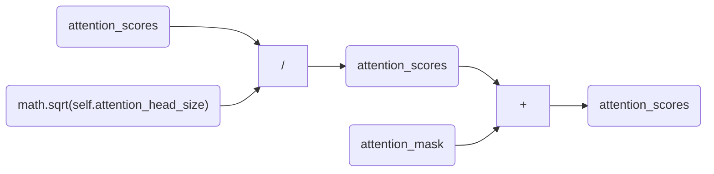

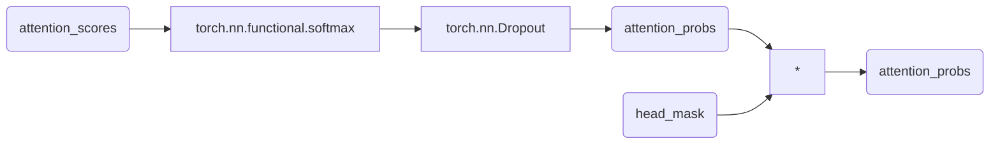

## BertIntermediate

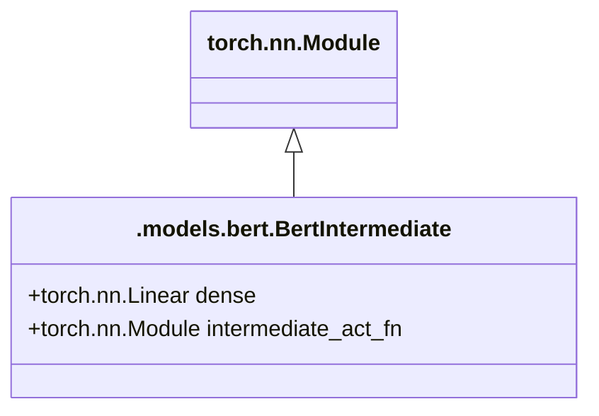

## BertOutput

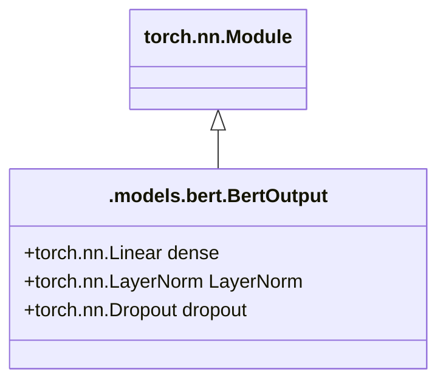

## BertPooler

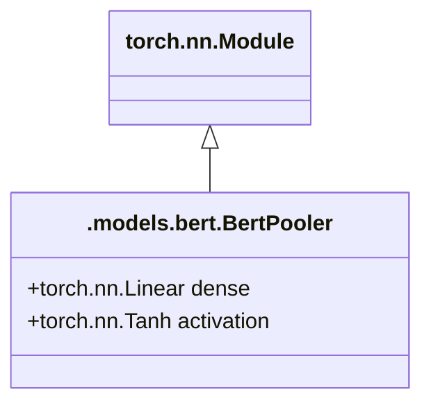
