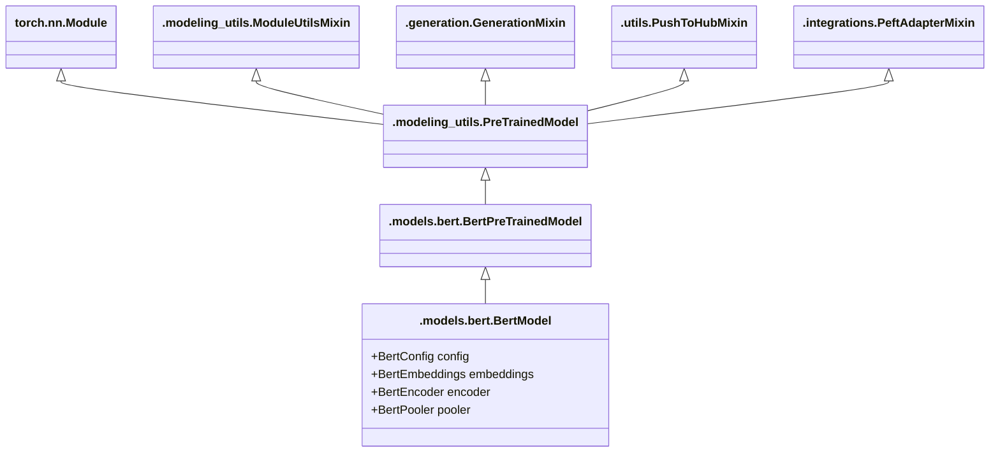

# BERT

```mermaid
classDiagram
  class Module["torch.nn.Module"]
  class ModuleUtilsMixin[".modeling_utils.ModuleUtilsMixin"]
  class GenerationMixin[".generation.GenerationMixin"]
  class PushToHubMixin[".utils.PushToHubMixin"]
  class PeftAdapterMixin[".integrations.PeftAdapterMixin"]
  class PreTrainedModel[".modeling_utils.PreTrainedModel"]
  class BertPreTrainedModel[".models.bert.BertPreTrainedModel"]
  class BertModel[".models.bert.BertModel"] {
    +BertConfig config
    +BertEmbeddings embeddings
    +BertEncoder encoder
    +BertPooler pooler
  }

  Module <|-- PreTrainedModel
  ModuleUtilsMixin <|-- PreTrainedModel
  GenerationMixin <|-- PreTrainedModel
  PushToHubMixin <|-- PreTrainedModel
  PeftAdapterMixin <|-- PreTrainedModel
  PreTrainedModel <|-- BertPreTrainedModel
  BertPreTrainedModel <|-- BertModel
```
